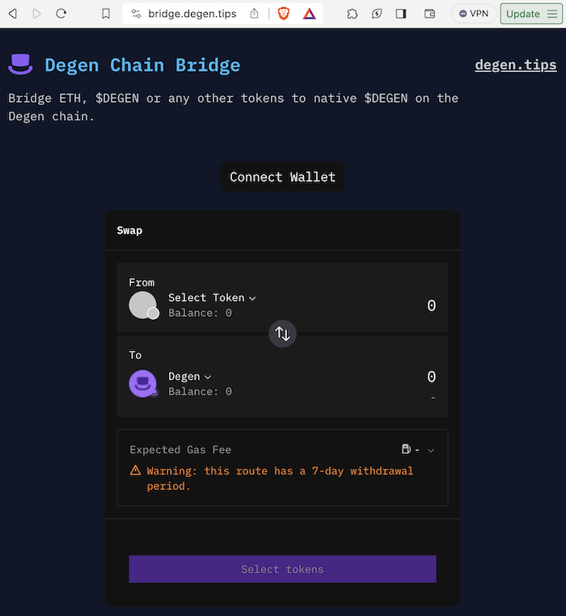
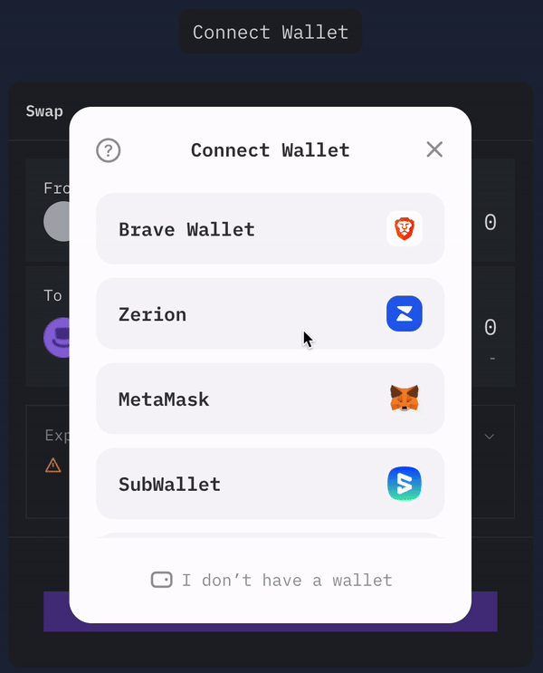
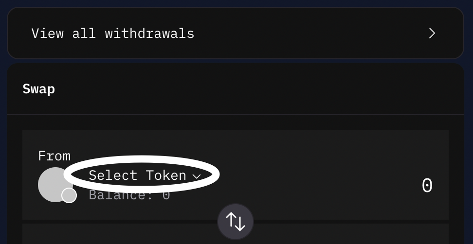
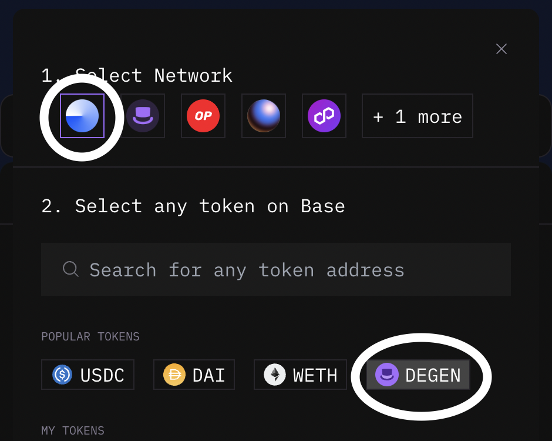
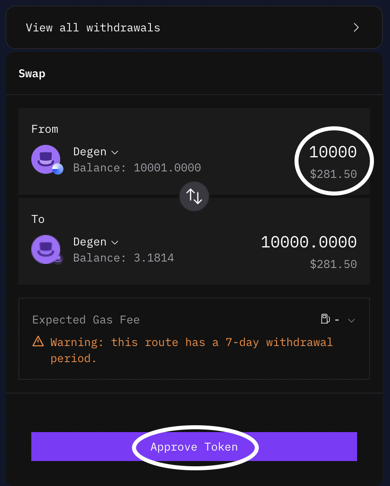
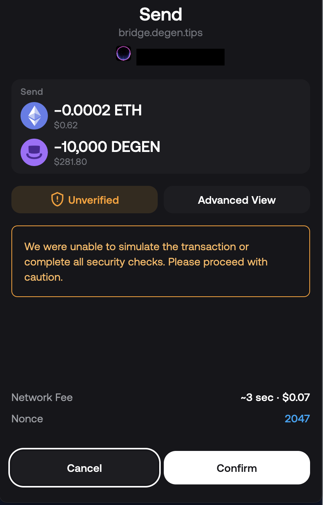

# $PROXY Token

The $PROXY ERC-20 token is the native governance token of ProxySwap DAO.

## Official Links

### Dexscreener Link

`https://dexscreener.com/degenchain/0xca5470b938db72887b420ac7688e8a14bea8b4de` - [🔗](https://dexscreener.com/degenchain/0xca5470b938db72887b420ac7688e8a14bea8b4de)

### Contract Address

```
0xA051A2Cb19C00eCDffaE94D0Ff98c17758041D16
```
`https://explorer.degen.tips/token/0xA051A2Cb19C00eCDffaE94D0Ff98c17758041D16` - [🔗](https://explorer.degen.tips/token/0xA051A2Cb19C00eCDffaE94D0Ff98c17758041D16)

## Getting Started

### Bridging $DEGEN 

<details><summary>expand</summary><br/>
ProxySwap is deployed in the DegenChain Layer-3 blockchain. As such, gas fees for making transactions (swaps, mints, add LP) is in [$DEGEN](https://dexscreener.com/base/0xc9034c3e7f58003e6ae0c8438e7c8f4598d5acaa) currency. 
  
  <br/>If you have not bridged $DEGEN to DegenChain from Base Mainnet, below is a quick tutorial.<br/><br/>

1. Go to `https://bridge.degen.tips/`  - [🔗](https://bridge.degen.tips/)



2. Connect your Wallet. This assumes you are using a self-custodial crypto wallet browser extensions such as Coinbase Wallet, Metamask, Rainbow, Zapper, Zerion for popular examples.
<br/>[Top of Section](#bridging-degen)



3. Click 'Select Token' dropdown on the From section.
<br/>[Top of Section](#bridging-degen)



4. Select `Base` as Network and `DEGEN` as Token
<br/>[Top of Section](#bridging-degen)



5. Enter the amount of $DEGEN tokens you like to bridge to DegenChain, and Click `Approve`.
<br/>[Top of Section](#bridging-degen)



6. Approve the transaction. and the execution of the trade swap.
<br/>[Top of Section](#bridging-degen)



</details>

### Token Swap for $PROXY using $DEGEN

<details><summary>expand</summary>

</details>
