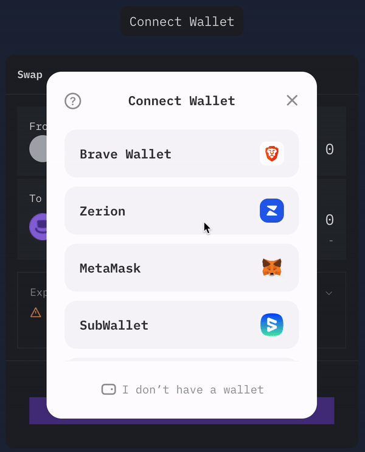
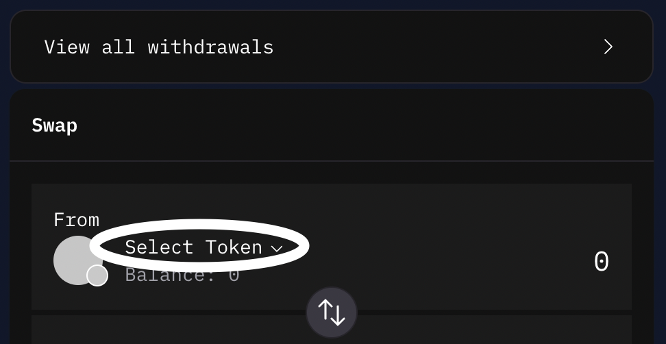

# $PROXY Token

The $PROXY ERC-20 token is the native governance token of ProxySwap DAO.

## Getting Started

### Bridging $DEGEN 

ProxySwap is deployed in the DegenChain Layer-3 blockchain. As such, gas fees for making transactions (swaps, mints, add LP) is in [$DEGEN](https://dexscreener.com/base/0xc9034c3e7f58003e6ae0c8438e7c8f4598d5acaa) currency. If you have not bridged $DEGEN to DegenChain from Base Mainnet, below is a quick tutorial.

1. Go to https://bridge.degen.tips/ 

2. Connect your Wallet. This assumes you are using a self-custodial crypto wallet browser extensions such as Coinbase Wallet, Metamask, Rainbow, Zapper, Zerion for popular examples.

3. Click 'Select Token' dropdown on the From section.

